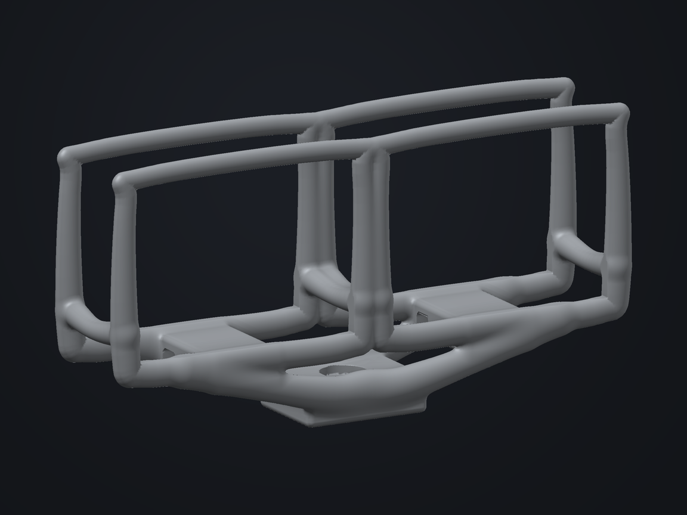

# Stereo camera frame — next design round

The goal is one real design, constructed from an empty document with the same public actions available in the application. The earlier three construction rounds are complete; this round exercises their tools against a camera assembly.

## Design and component evidence

The first revision used two rounded box shoulders and a shallow bridge. Its openings and connectivity worked, but visual inspection found it too rectangular. The second revision replaces the shoulders with four tapered sweep collars, four lower depth spines and two sweeping mounting bridges. It retains two integral strap tunnels and a flat central fixing pad. A final functional pass moved the tunnels across X near the rear of each camera, keeping the strap route away from the full front face. Four endpoint relationships retain the connection between collars and bridges.

The authored frame uses 25 editable shapes, including ten sweeps, two displayed camera references, two linked clearance cuts and four endpoint attachments. Its complete command recipe starts with `start`; reference insertion, Boolean cuts and endpoint attachment use the public construction API. It is one worked design, not a new template collection.

The existing GoPro HD HERO reference has local bounds 60 × 43.2 × 30 mm. Decoded GLB extents agree with the catalog dimensions. This exterior reconstruction does not identify the user's actual cameras. The stereo form therefore accepts measured camera envelopes rather than assuming lens centres, shutter positions or connector coordinates. Default camera-envelope centre spacing is 72 mm; per-side clearance is 0.5 mm and nominal wall scale is 3.2 mm. Wall scale changes varying sweep sections; it is not a uniform measured wall thickness.

Front and rear access cover the entire rectangular camera envelope. Rear insertion corridors, top and side access, strap routes, a 6.8 mm unthreaded fixing bore and a 12 mm fixing-head recess are actual subtract operations. The bore is an interface for a separate fixing or insert; it is not a modelled tripod thread.

## Reusable improvements

- **Component fit:** measured local XYZ envelope, per-side XYZ clearance and one local insertion direction/travel in the component dock. Explicit Apply operations record one undo step. The CAD reference keeps its own proportions; a green outline shows the measured envelope.
- **Linked cuts:** moving, rotating or scaling the component updates its cavity before downstream sweep endpoints resolve. Hiding a component or cut retains its link. Direct geometric edits release the link. Removing a component freezes its last resolved cavity. Imports reject malformed or unsupported links rather than clipping dimensions.
- **Explicit stereo regeneration:** six docked parameters rebuild the same named construction. Manual edits remain available through undo or a saved alternative; rebuilding preserves the viewing camera.
- **Face sampling:** a bounded nonuniform export grid straddles eligible axis-aligned sharp box faces. It prioritizes subtract faces and removes cap planes that cannot be real exposed boundaries. Global deformation, shells and lattices retain ordinary sampling. Added planes and the largest grid interval are reported; neither is a fit tolerance.
- **Transported sweeps:** conservative bounds restore branch pruning for flattened transported sections. Independent field comparisons and a byte-identical truss mesh check protect geometric equivalence. Observed timing improved, but this is not a general speed guarantee.

## Checks and findings

The geometry tests inspect both camera envelopes and insertion corridors, access paths, retention tunnel walls and the fixing bore. An independent triangle/box separating-axis check tests the actual exported triangles against both hardware envelopes expanded by 0.45 mm, allowing 0.05 mm below the authored 0.5 mm clearance.

The first sculpted 96-grid mesh exposed four Float32-collinear triangles near feature sampling planes. That failure is retained as a regression. Removing redundant cut caps prevents unnecessary tiny cells around overlapping front/rear access. Further mesh sampling checks cover changed camera dimensions and larger wall scales. When Float32 roots still collapse, the mesher makes bounded complete grid retries, retaining face alignment where possible. It reports the actual returned sampling; no face is dropped or audit threshold weakened. The final camera export retains its face planes with a deterministic phase retry.

For the known sharp rectangular rim fixture, the original uniform grid had approximately 0.4 mm triangle-centroid and 0.6 mm edge-midpoint error. Face alignment substantially reduced those observed errors and preserved the analytic rim volume while remaining one closed component. These fixture measurements do not establish the tolerance of every feature in the camera frame.

## Next physical design work

Confirm the actual cameras and measure envelopes, optical axes, connector and control access, strap width and mounting hardware. Then inspect the loaded reference assembly and print contact coupons or the frame before asserting physical fit. Test retention and mounting loads on the chosen material; no structural optimization or load simulation was performed. Native iPhone rendering, keyboard timing and sustained GPU performance still need a device check.

The application needs continuing attention to tiny-cell quantization around curved/sharp intersections, parameter combinations outside the verified examples and a more detailed physical clearance workflow. The present checks cover finite geometry, triangle connections and the stated sampled/triangle interface tests, not self-intersections or material strength.

## Final geometry verification

| Measurement | Standard 220 | Refined 220 |
| --- | ---: | ---: |
| Triangles | 331,052 | 332,548 |
| Dimensions, mm | 147.7882 × 74.6476 × 35.1959 | 147.7882 × 74.6476 × 35.1959 |
| Volume, mm³ | 46,052.3798 | 46,052.5215 |
| Connected pieces | 1 | 1 |
| Open, nonmanifold, winding-conflict, degenerate faces | 0 | 0 |
| Triangle collisions with both camera envelopes +0.45 mm | 0 | 0 |

Both final meshes contain finite coordinates and valid indices. The refined mesh adds 1,496 triangles in two bounded passes. Its sampled mean edge/face field residuals improve from 0.005893/0.007660 to 0.005806/0.007545 field units; maximum residuals remain 0.2703/0.2218 field units. `qualityLimited` remains true where projecting a corner would worsen geometry. This is not a global geometric tolerance.

The largest reported sampling interval is 1.0311 mm, with 8/4/0 added face planes and a 0.002 mm face-plane offset. The actual triangle/envelope check is separate from those sampling measurements. Generation of the final refined export took 33.5 seconds on this development run, including retry and refinement. Phone timing remains unmeasured.

The full test suite passed 121 tests before the final retention direction change; all 16 camera and sampling regressions passed again after that change. TypeScript, scoped new-code lint and production build pass. The existing application contains React lint findings outside this round; the legacy page was also checked with its existing ref/effect rule exclusions. [Sampling findings](mesh-sampling-findings.md) provide the reproducible fixture and quantization details.

Live editing, undo, persistence and export report verification follows in the production record.
