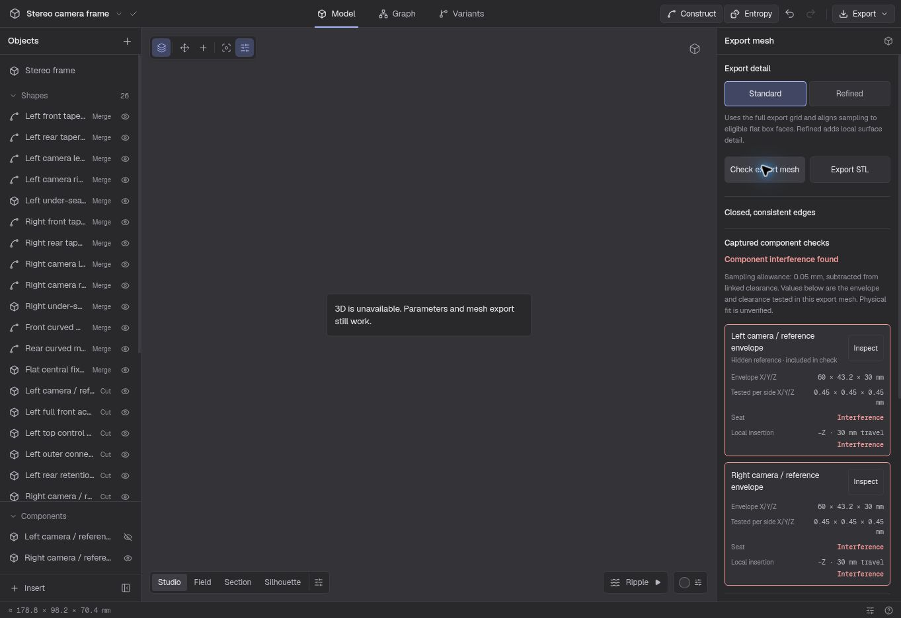
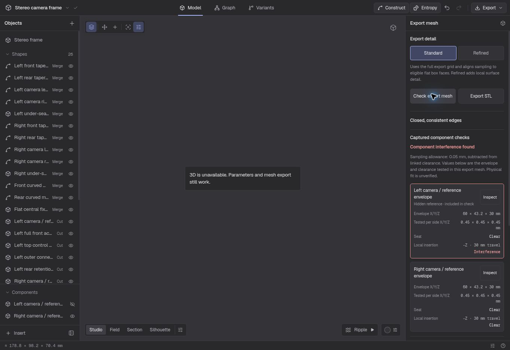
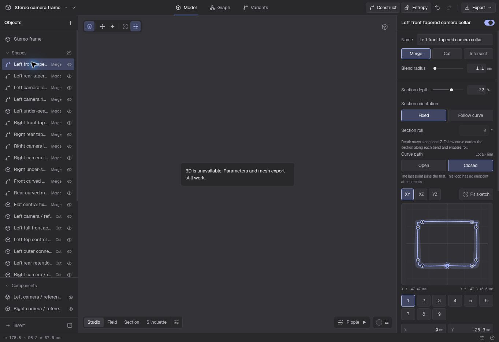

# Stereo frame: continuous collars and checked insertion

This round improves the existing stereo frame rather than introducing another template. The same 25 shapes, two dimensioned reference envelopes, two linked clearance cuts and four mounting-bridge attachments remain. Camera, access and mounting assumptions are unchanged. The default 60 × 43.2 × 30 mm envelopes come from the reference asset; the user's actual cameras are not yet identified or measured.

## Continuous editable collars

The four camera collars now use explicit closed sweeps with nine unique controls. Previously a tenth control repeated the first point to make the geometry appear closed. Editing either repeated control could separate the two sides of that seam. Closure is now part of the saved shape: the curve generates its seam from the same first control and interpolates cyclically.

The first control retains its authored radius, so the stereo parameter editor still infers the same nominal wall scale. The mounting bridges stay open and retain their endpoint attachments to the closed collars. A closed collar is an attachment target; it does not have independent start/end attachment endpoints.

The centreline remains an approximation: each cubic Hermite interval uses eight subdivisions, and the implicit sweep evaluates their swept segments. Explicit closure fixes the cyclic interpolation and editable seam; it does not introduce adaptive curve sampling or a guaranteed geometric tolerance. Mesh refinement also does not reconstruct an exact continuous sweep.

The study tests check unique controls, generated seam closure, editing the seam through the public construction API, unchanged reference-space openings, retention routes, fixing bore and deterministic regeneration. The default collar seam is also compared with its former repeated-control representation, independently of the full mesh.

## Check actual mesh space

The renderer now records the reusable component-fit check alongside the existing independent stereo triangle/box check. For the two dimensioned reference envelopes, both the seated volume and the entire straight rear insertion volume must be clear. Triangle intersection alone is insufficient: a reference volume completely enclosed by a solid can intersect no surface triangles, so the component checker also tests whether its centre is inside the exported solid.

The authored per-side clearance remains 0.5 mm. The triangle checks reserve 0.05 mm for sampling and therefore check 0.45 mm of additional rectangular reference space. These figures describe tested geometry, not a physical camera-fit or manufacturing tolerance. The actual camera model, optical axes, controls, connectors, strap and fixing hardware still require measurements.

The render command's `--verify` flag rejects invalid or defective topology, a disconnected frame, an independent stereo-envelope collision, an interfering component seat/insertion, or an unverified component result. Hidden reference components remain part of the check. The report distinguishes mesh generation timing from mesh verification, which includes topology, component fit and the independent stereo check. The combined checker computes a fresh topology report from these same arrays, rather than accepting an external report as proof that containment can be trusted.

## Geometry verification

The actual 96-grid preview and final 220-grid exports were generated with the closed-sweep engine and component-fit checker. The subsequent transported-frame mirror fallback fix does not affect these fixed-section collars. All three exports passed `--verify`; the checks below use their actual triangles rather than a visual estimate or the analytic field alone.

| Export | Triangles | Dimensions, mm | Volume, mm³ | Generation | Verification |
| --- | ---: | --- | ---: | ---: | ---: |
| 96 preview | 67,544 | 147.770 × 74.631 × 35.190 | 45,406.379 | 2.574 s | 0.296 s |
| 220 standard | 331,052 | 147.788 × 74.648 × 35.196 | 46,052.380 | 29.606 s | 1.363 s |
| 220 refined | 332,548 | 147.788 × 74.648 × 35.196 | 46,052.522 | 41.983 s | 1.357 s |

Each export is one connected piece, with finite positions and zero invalid triangles, degenerate triangles, open edges, nonmanifold edges or winding inconsistencies. The independent stereo check found zero camera-envelope intersections at the tested 0.45 mm per-side clearance. The reusable fit check independently reported both seats and both entire 30 mm straight rear insertion corridors clear: zero intersecting triangles and each reference centre outside the solid.

The final triangle counts, dimensions and volumes match the previous stereo design. This round improves editing semantics and actual mesh-space evidence without adding decorative geometry. The refined export added 1,496 triangles over two passes; its maximum sampled face residual fell from 0.354 to 0.222 mm. Refinement remains quality-limited, so this sampled residual is not a whole-surface tolerance. Timings are measurements of this development run, not a speed claim for other devices.

The final front and rear CPU renders were inspected for continuous collars, reference-space access, retention tunnels and the mount. They render the exported geometry; camera reference assets are not included in the STL.

The ten stereo study regressions pass, including cyclic seam editing, the previous default seam comparison, parameter inference, public-command regeneration and actual 96-grid topology/fit checks. The root validation run also passed all 148 tests, TypeScript and scoped lint with no errors. Build and browser validation are recorded separately after publication.

## Application validation

All 148 tests pass, including open-curve compatibility, cyclic frame closure, mirrored degenerate seams, atomic import/edit rejection and stale-topology fit regressions. TypeScript passes. Scoped lint reports zero errors; the existing engine warning and eight page warnings remain, with the page's two pre-existing React hook rules excluded from that scoped check. `git diff --check` passes.

The initial production build passes with 54 local PWA assets and content hash `5265613013ac21c1`. Preview interaction and publication checks follow below.

The deployed preview at commit `071e23dc05f8d17dbd70947af8d705c7bb4a94dd` was exercised through the visible editor and public construction tools. Opening a collar retains all nine controls and one Undo restores the exact frame. Inserting after its ninth control wraps toward the first, creates the expected midpoint, and one Undo restores the original. The sketch viewBox stays unchanged through those edits. An exact coincident-point edit on a temporarily rounded control fixture produces the inline distinct-point error, resets the field, and leaves all point values intact; Undo restores the unrounded frame exactly.

This cloud browser reports that 3D is unavailable. It verifies the editing controls and actual export worker, while the final front/rear images above come from the exported mesh rendered on the CPU. GPU interaction and performance on a physical phone remain untested here.

The deployed Standard export worker returned 331,052 triangles, one connected piece and zero open/nonmanifold/winding edges. The dock reported both camera seats and full 30 mm rear insertion corridors Clear, showing the 60 × 43.2 × 30 mm envelopes and 0.45 mm tested clearance per side. This browser run took 21.5 s; it is not a phone-performance measurement.

A deliberate late solid at X −36, Y 0, Z −28 mm (20 × 20 × 4 mm, sharp box) was detected even with its camera reference hidden. The Interference report stayed prominent alongside Closed, consistent edges, and Inspect opened that exact reference's envelope/cavity controls. Undoing the blocker and visibility change restored the exact original model. Saving a named alternative and reloading retained all four closed collars, their controls and the alternative; changing sketch plane also preserved its viewBox.

This failure test exposed a sampling limitation in the initial preview: a solid added after the cuts globally disabled pruning of hidden cut caps, the aligned retries fell back to an ordinary grid, and the captured mesh then intersected both seats as well as the intended left insertion blocker. The checker correctly reported those actual triangles. The sampler follow-up below addresses the unnecessarily global cap guard rather than widening the reported clearance allowance.

Closing the linked front mounting bridge through the visible editor removes its two endpoint links while retaining every resolved control coordinate. One Undo restores the exact original four-link frame.

The explicit sketch-fit minimum is now 32 mm instead of 200 mm, with the same 1.24 extent margin. The actual camera collar therefore uses a 93.9025 mm sketch span and fills more of the available drawing area. Tests cover all transported-section extents in XY/XZ/YZ and a small offset section. Editing and switching planes still preserve the viewBox; only initial fitting and the Fit sketch action change it.

The main-thread fallback now uses the same validated snapshot and fresh combined topology/component audit as the worker. Its STL is serialized from that same captured mesh, so browsers unable to create the worker do not silently omit component checks. This path was reviewed in code; the deployed interaction checks used the worker.

## Recovery verified by the failure case

Hidden-cap pruning now reasons about each covered face and the original covering cut's position in the ordered construction. It retains cap planes if any later union is blended or its conservative world bounds overlap/touch the expanded cap slab. This includes unions between the covering and target cuts. Post-construction lens seats prohibit pruning. The proof and adversarial cases received an independent review.

At the production grid, correcting that guard alone did not remove all Float32-collapsed triangles. The exporter therefore preserves its existing 0.002 mm face brackets and ordinary-node phase retry, then allows one 0.02 mm bracket retry with the same phase before its existing uniform fallbacks. This is a change to sampling nodes, not the model or tested clearance. It regenerates the complete topology and records the actual successful offset, phase and quantization limitation. Disabled, deformed, shell and lattice grids cannot acquire face alignment through this path. No collapsed triangles are deleted to manufacture a clean report.

| Deliberate blocker check | 96 grid | 220 grid |
| --- | ---: | ---: |
| Captured triangles | 76,084 | 355,512 |
| Actual bracket offset, mm | 0.002 | 0.02 |
| Connected pieces | 2 | 2 |
| Topology defects | 0 | 0 |
| Both seated envelopes, +0.45 mm per side | Clear | Clear |
| Left insertion triangle intersections | 4,128 | 16,168 |
| Right insertion | Clear | Clear |

The 220 result has 177,732 vertices and volume 47,657.1062 mm³. Its actual added planes are `[11,8,4]` and ordinary-node phase is `[0.173,0.223,0.265]`. The second disconnected piece is the intentional test blocker. The original frame's production regression retains its prior aligned output. These are checks of the captured mesh, not an all-model tolerance guarantee; the additional guarded retry costs another generation attempt when required.

After integrating recovery and the smaller sketch fit, all 155 tests pass with zero failures/skips. The final production build passes with 54 local PWA assets and content hash `c1ea101a0d96db9a`. The recovery and fallback paths received independent code review.

The final release preview at commit `e543b911c2f635a8a6fdd6dea3589948b3865002` confirms the same failure case through the actual browser worker: 355,512 triangles, two closed components, zero open/nonmanifold/winding edges and 23 added face planes. Both seats show Clear, only the hidden left reference's insertion shows Interference, and right insertion stays Clear. Generation plus verification took 42.0 s in this browser. Two Undo actions restore the exact original frame and reference visibility. The smaller closed-curve sketch also shows the expected 93.9025 mm span. Subsequent evidence commits only add this journal and screenshots; application source remains identical to this verified release.

## Further design work

Continuous loops make collar editing safer and support curved rings without a duplicated seam. The fit report gives the designer evidence about seated and straight insertion space against the housing mesh. It does not check collisions between components or infer an insertion assembly sequence, flexing clip behavior, optical field of view, self-intersections, material strength or retention loads. Those remain separate design questions for the same frame.
