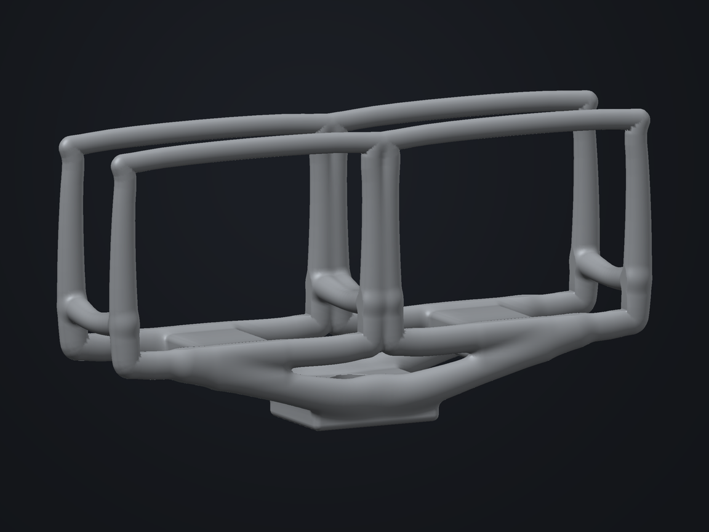

# Stereo frame: continuous collars and checked insertion

This round improves the existing stereo frame rather than introducing another template. The same 25 shapes, two measured reference envelopes, two linked clearance cuts and four mounting-bridge attachments remain. Camera, access and mounting assumptions are unchanged.

## Continuous editable collars

The four camera collars now use explicit closed sweeps with nine unique controls. Previously a tenth control repeated the first point to make the geometry appear closed. Editing either repeated control could separate the two sides of that seam. Closure is now part of the saved shape: the curve generates its seam from the same first control and interpolates cyclically.

The first control retains its authored radius, so the stereo parameter editor still infers the same nominal wall scale. The mounting bridges stay open and retain their endpoint attachments to the closed collars. A closed collar is an attachment target; it does not have independent start/end attachment endpoints.

The centreline remains an approximation: each cubic Hermite interval uses eight subdivisions, and the implicit sweep evaluates their swept segments. Explicit closure fixes the cyclic interpolation and editable seam; it does not introduce adaptive curve sampling or a guaranteed geometric tolerance. Mesh refinement also does not reconstruct an exact continuous sweep.

The study tests check unique controls, generated seam closure, editing the seam through the public construction API, unchanged reference-space openings, retention routes, fixing bore and deterministic regeneration. The default collar seam is also compared with its former repeated-control representation, independently of the full mesh.

## Check actual mesh space

The renderer now records the reusable component-fit check alongside the existing independent stereo triangle/box check. For the two measured reference envelopes, both the seated volume and the entire straight rear insertion volume must be clear. Triangle intersection alone is insufficient: a reference volume completely enclosed by a solid can intersect no surface triangles, so the component checker also tests whether its centre is inside the exported solid.

The authored per-side clearance remains 0.5 mm. The triangle checks reserve 0.05 mm for sampling and therefore check 0.45 mm of additional rectangular reference space. These figures describe tested geometry, not a physical camera-fit or manufacturing tolerance. The actual camera model, optical axes, controls, connectors, strap and fixing hardware still require measurements.

The render command's `--verify` flag rejects invalid or defective topology, a disconnected frame, an independent stereo-envelope collision, an interfering component seat/insertion, or an unverified component result. Hidden reference components remain part of the check. The report distinguishes mesh generation timing from mesh verification, which includes topology, component fit and the independent stereo check. The combined checker computes a fresh topology report from these same arrays, rather than accepting an external report as proof that containment can be trusted.

## Geometry verification

The actual 96-grid preview and final 220-grid exports were generated with the closed-sweep engine and component-fit checker. The subsequent transported-frame mirror fallback fix does not affect these fixed-section collars. All three exports passed `--verify`; the checks below use their actual triangles rather than a visual estimate or the analytic field alone.

| Export | Triangles | Dimensions, mm | Volume, mm³ | Generation | Verification |
| --- | ---: | --- | ---: | ---: | ---: |
| 96 preview | 67,544 | 147.770 × 74.631 × 35.190 | 45,406.379 | 2.574 s | 0.296 s |
| 220 standard | 331,052 | 147.788 × 74.648 × 35.196 | 46,052.380 | 29.606 s | 1.363 s |
| 220 refined | 332,548 | 147.788 × 74.648 × 35.196 | 46,052.522 | 41.983 s | 1.357 s |

Each export is one connected piece, with finite positions and zero invalid triangles, degenerate triangles, open edges, nonmanifold edges or winding inconsistencies. The independent stereo check found zero camera-envelope intersections at the tested 0.45 mm per-side clearance. The reusable fit check independently reported both seats and both entire 30 mm straight rear insertion corridors clear: zero intersecting triangles and each reference centre outside the solid.

The final triangle counts, dimensions and volumes match the previous stereo design. This round improves editing semantics and actual mesh-space evidence without adding decorative geometry. The refined export added 1,496 triangles over two passes; its maximum sampled face residual fell from 0.354 to 0.222 mm. Refinement remains quality-limited, so this sampled residual is not a whole-surface tolerance. Timings are measurements of this development run, not a speed claim for other devices.

The final front and rear CPU renders were inspected for continuous collars, reference-space access, retention tunnels and the mount. They render the exported geometry; camera reference assets are not included in the STL.

The ten stereo study regressions pass, including cyclic seam editing, the previous default seam comparison, parameter inference, public-command regeneration and actual 96-grid topology/fit checks. The root validation run also passed all 148 tests, TypeScript and scoped lint with no errors. Build and browser validation are recorded separately after publication.

## Application validation

All 148 tests pass, including open-curve compatibility, cyclic frame closure, mirrored degenerate seams, atomic import/edit rejection and stale-topology fit regressions. TypeScript passes. Scoped lint reports zero errors; the existing engine warning and eight page warnings remain, with the page's two pre-existing React hook rules excluded from that scoped check. `git diff --check` passes.

The production build passes with 54 local PWA assets and content hash `5265613013ac21c1`. Preview interaction and publication checks follow below.

## Further design work

Continuous loops make collar editing safer and support curved rings without a duplicated seam. The fit report gives the designer evidence about seated and straight insertion space. It does not infer an insertion assembly sequence, flexing clip behavior, optical field of view, self-intersections, material strength or retention loads. Those remain separate physical-design questions for the same frame.
